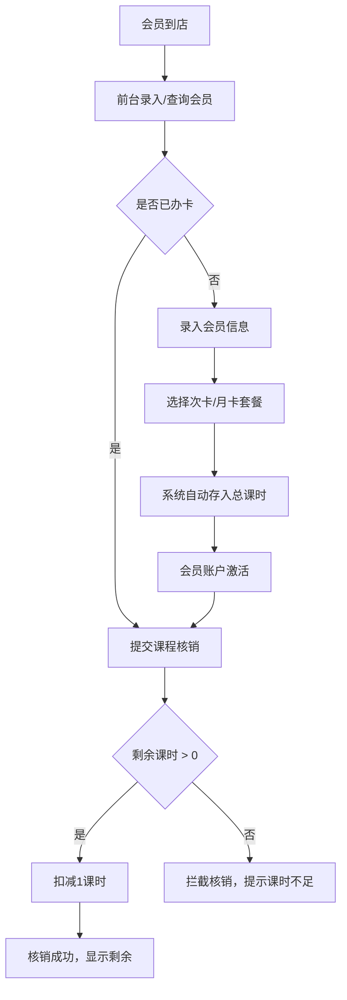

## 1. 产品概述

健身房会员办卡、课时消耗管理系统，面向前台工作人员与后台管理人员，提供会员信息录入、套餐办卡、课程核销等完整业务闭环。通过系统化管理提升前台操作效率，确保课时扣减准确无误。

- 核心价值：实现健身房会员从办卡到课时消耗的全流程数字化管理
- 目标用户：前台接待人员、健身房运营管理者

## 2. 核心功能

### 2.1 用户角色

| 角色 | 登录方式 | 核心权限 |
|------|----------|----------|
| 前台工作人员 | 无需登录（开放页面） | 录入会员信息、办理套餐、核销课程 |
| 后台管理员 | 无需登录（开放页面） | 查看所有会员、课时余额、卡片到期状态 |

### 2.2 功能模块

1. **前台操作页面**：会员信息录入、套餐选择办卡、课程核销
2. **后台管理页面**：会员列表分页展示、课时余额查看、过期卡片标红、核销记录

### 2.3 页面详情

| 页面名称 | 模块名称 | 功能描述 |
|----------|----------|----------|
| 前台操作页 | 会员信息表单 | 录入姓名、手机号、性别等基础身份信息 |
| 前台操作页 | 套餐选择 | 次卡（如10次/30次）、月卡（1个月/3个月）两类套餐 |
| 前台操作页 | 课程核销 | 输入会员手机号或选择会员，提交核销指令扣减课时 |
| 前台操作页 | 核销结果提示 | 课时不足时拦截并明确提示，核销成功显示剩余课时 |
| 后台管理页 | 会员列表 | 分页展示所有会员，支持按姓名/手机号搜索 |
| 后台管理页 | 课时余额展示 | 显示当前剩余课时、总课时、已用课时 |
| 后台管理页 | 卡片到期管理 | 过期卡片自动标红，显示到期日期 |
| 后台管理页 | 核销模拟 | 录入办卡数量、多次模拟核销验证计算准确性 |

## 3. 核心流程

### 办卡流程
前台录入会员基础信息 → 选择次卡/月卡套餐 → 系统自动录入对应总课时额度 → 会员账户创建完成

### 核销流程
前台选择会员 → 提交核销请求 → 后端检查剩余课时 → 课时充足则扣减1课时并返回成功 → 课时为0则拦截核销并给出提示

## 4. 用户界面设计

### 4.1 设计风格
- 主色调：深蓝 #1e3a5f，活力橙 #ff6b35 作为强调色
- 辅色：中性灰系列，成功绿 #10b981，警告红 #ef4444
- 按钮风格：圆角 8px，悬停时轻微上浮与阴影变化
- 字体：展示字体使用 Poppins，正文字体使用 Noto Sans SC
- 布局风格：卡片式布局，顶部导航切换前后台
- 图标风格：使用 lucide-react 线性图标

### 4.2 页面设计概览

| 页面名称 | 模块名称 | UI 元素 |
|----------|----------|---------|
| 前台操作页 | 会员信息表单 | 卡片容器、输入框分组、套餐卡片选择网格、核销按钮动效 |
| 前台操作页 | 套餐卡片 | 渐变边框、选中状态高亮、课时数量醒目展示 |
| 前台操作页 | 结果提示 | Toast 弹窗动画、成功/失败状态颜色区分 |
| 后台管理页 | 会员表格 | 斑马纹行、过期行红色背景、数据分页控件 |
| 后台管理页 | 模拟操作区 | 输入卡片数量、批量核销按钮、结果日志面板 |

### 4.3 响应式
桌面端优先设计，主要适配 1280px 及以上分辨率，表格区域支持横向滚动。

### 4.4 动效设计
- 页面加载时卡片逐个淡入上移
- 套餐卡片选中时缩放 1.02 并显示对勾
- 核销按钮点击时产生涟漪效果
- Toast 提示从顶部滑入后自动淡出
