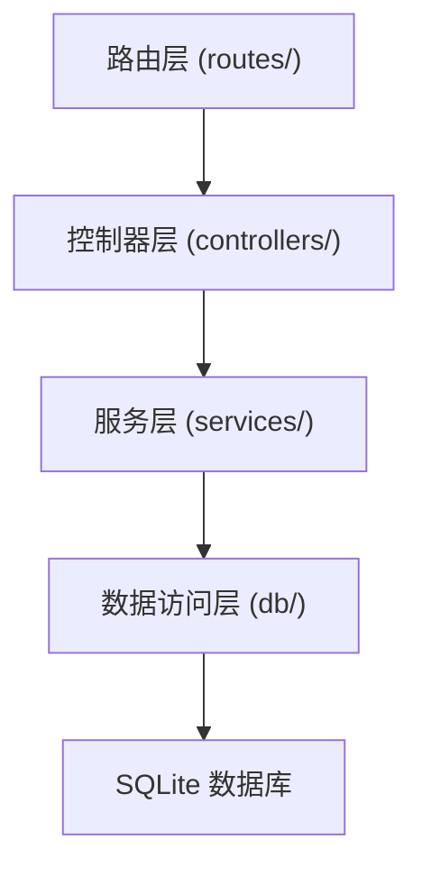
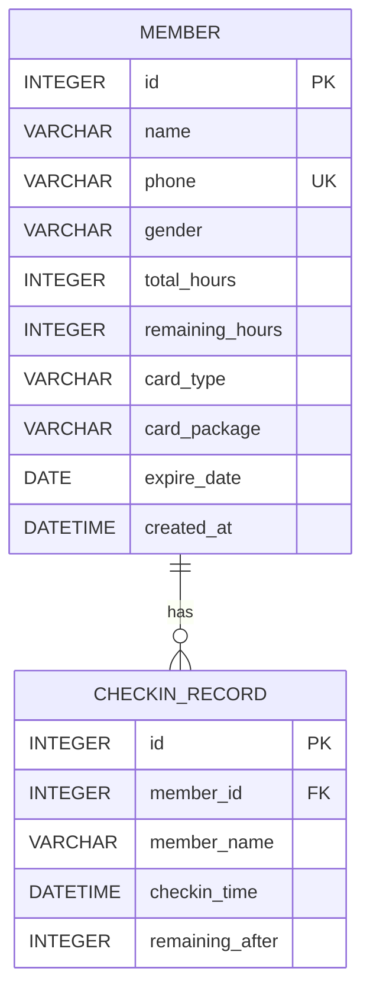

## 1. 架构设计


## 2. 技术描述

- 前端：React@18 + TypeScript + Vite + TailwindCSS@3 + React Router DOM + Zustand + Lucide React
- 后端：Express@4 + TypeScript + better-sqlite3（轻量级本地数据库）
- 初始化工具：vite-init（react-express-ts 模板）
- 前后端通信：RESTful API + JSON

## 3. 路由定义

| 前端路由 | 用途 |
|----------|------|
| / | 前台操作页（会员录入、办卡、核销） |
| /admin | 后台管理页（会员列表、课时余额、模拟核销） |

## 4. API 定义

### 4.1 会员相关

```typescript
// 会员类型
interface Member {
  id: number;
  name: string;
  phone: string;
  gender: 'male' | 'female' | 'other';
  totalHours: number;      // 总课时
  remainingHours: number;  // 剩余课时
  cardType: 'times' | 'monthly';  // 次卡 / 月卡
  cardPackage: string;     // 套餐名称，如 "10次卡"、"月度卡"
  expireDate: string;      // 到期日期 YYYY-MM-DD
  createdAt: string;
}

// 创建会员
POST /api/members
Request: { name, phone, gender, cardType, cardPackage }
Response: Member

// 查询会员列表
GET /api/members?page=1&pageSize=10&keyword=
Response: { list: Member[], total: number }

// 按手机号查询单个会员
GET /api/members/phone/:phone
Response: Member | null
```

### 4.2 核销相关

```typescript
// 核销记录
interface CheckinRecord {
  id: number;
  memberId: number;
  memberName: string;
  checkinTime: string;
  remainingAfter: number;
}

// 提交核销
POST /api/checkin
Request: { memberId: number }
Response: { success: boolean; message: string; remainingHours: number }

// 获取核销记录
GET /api/checkin-records?memberId=
Response: CheckinRecord[]
```

### 4.3 套餐配置

```typescript
// 套餐定义
interface Package {
  id: string;
  name: string;
  type: 'times' | 'monthly';
  hours: number;       // 总课时
  durationDays: number; // 有效天数
  price: number;
}

// 获取套餐列表
GET /api/packages
Response: Package[]
```

## 5. 后端服务架构



## 6. 数据模型

### 6.1 ER 图



### 6.2 DDL 语句

```sql
CREATE TABLE IF NOT EXISTS members (
  id INTEGER PRIMARY KEY AUTOINCREMENT,
  name VARCHAR(50) NOT NULL,
  phone VARCHAR(20) UNIQUE NOT NULL,
  gender VARCHAR(10) DEFAULT 'other',
  total_hours INTEGER NOT NULL DEFAULT 0,
  remaining_hours INTEGER NOT NULL DEFAULT 0,
  card_type VARCHAR(20) NOT NULL,
  card_package VARCHAR(50) NOT NULL,
  expire_date DATE NOT NULL,
  created_at DATETIME DEFAULT CURRENT_TIMESTAMP
);

CREATE TABLE IF NOT EXISTS checkin_records (
  id INTEGER PRIMARY KEY AUTOINCREMENT,
  member_id INTEGER NOT NULL,
  member_name VARCHAR(50) NOT NULL,
  checkin_time DATETIME DEFAULT CURRENT_TIMESTAMP,
  remaining_after INTEGER NOT NULL,
  FOREIGN KEY (member_id) REFERENCES members(id)
);

CREATE INDEX IF NOT EXISTS idx_members_phone ON members(phone);
CREATE INDEX IF NOT EXISTS idx_checkin_member ON checkin_records(member_id);
```

### 6.3 初始数据（套餐）

内置套餐配置（代码中定义）：
- 次卡类：10次卡（10课时，365天）、30次卡（30课时，365天）
- 月卡类：月度卡（30课时，30天）、季度卡（90课时，90天）
